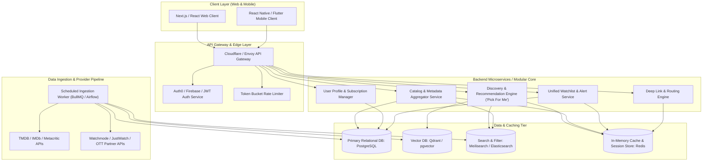
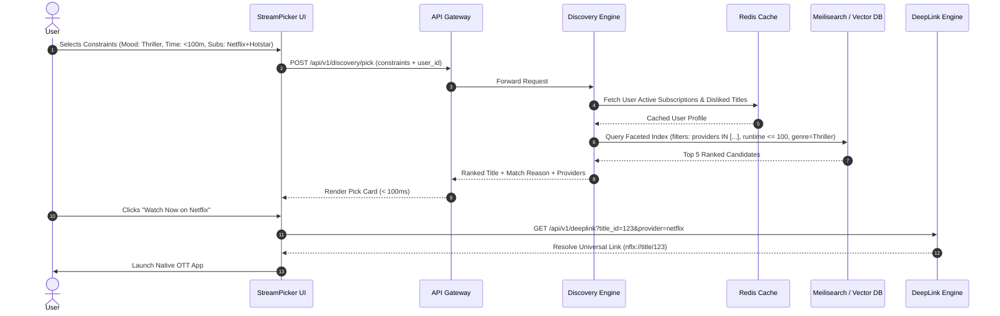
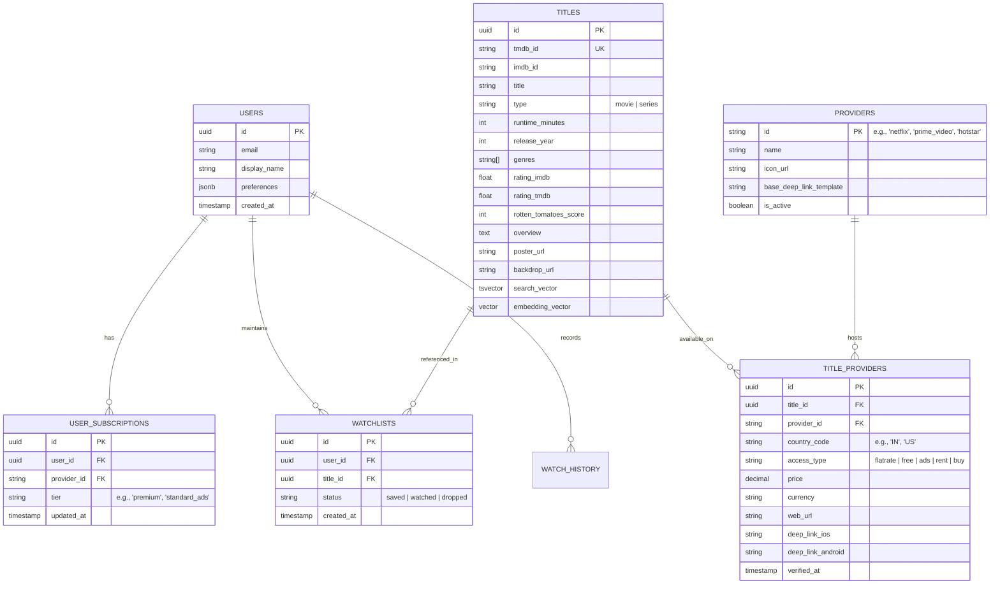

# System Architecture Document: StreamPicker OTT Discovery Engine

## 1. System Overview & Architectural Objectives
**StreamPicker** is designed as a high-performance, low-latency, cross-platform OTT discovery engine. The architecture prioritizes:
- **Sub-Second Search & Filtering Latency** ($<100\text{ ms}$ API response time) to support the sub-30-second user decision loop.
- **Provider & Availability Aggregation** across major OTT platforms (Netflix, Prime Video, Disney+ Hotstar, JioCinema, Apple TV+, etc.).
- **Smart Constraint & Recommendation Engine** enabling zero-scroll "Pick For Me" and mood/runtime/subscription-based filtering.
- **Resilient Deep-Linking** to launch native streaming apps or web players directly at the target media item.

---

## 2. High-Level Architecture Diagram



---

## 3. Core Component Breakdown

### 3.1 Client Layer (Frontend)
- **Framework**: Next.js 14+ (App Router) for Web / PWA, React Native or Flutter for Mobile.
- **Key Modules**:
  - **Decision Cockpit ("Pick For Me")**: Interactive constraint picker (Mood, Runtime, Subscriptions, Minimum Rating).
  - **Unified Search Bar**: Instant debounced search querying the Meilisearch cluster.
  - **Universal Watchlist Hub**: Centralized bookmarking with cross-platform availability tags (Free with Sub, Rent, Buy).
  - **Subscription Switchboard**: User toggle switch for active OTT subscriptions.

### 3.2 Ingestion & Provider Availability Pipeline
- **Metadata Sources**:
  - **TMDB API**: Master catalog for titles, cast, crew, synopsis, posters, backdrops, and genres.
  - **Watchmode / JustWatch / OTT APIs**: Real-time regional streaming availability, streaming types (`flatrate`, `free`, `ads`, `rent`, `buy`), and localized deep links.
  - **IMDb & Rotten Tomatoes**: Aggregated critic and audience score normalization.
- **Ingestion Worker**:
  - Async job queues (e.g., BullMQ with Redis or Apache Airflow) scheduled to sync catalog updates every 6–12 hours.
  - Delta updates for new releases, price shifts, and catalog licensing expirations.

### 3.3 Search & Discovery Engine
- **Full-Text & Faceted Search**:
  - Powered by **Meilisearch** or **Elasticsearch** for typo-tolerant, instant indexing on `title`, `actors`, `director`, `genres`, `providers`, `certification`, `runtime`, and `release_year`.
- **"Pick For Me" Constraint Resolution Engine**:
  - Filtering algorithm that runs in $<30\text{ ms}$:
    $$\text{Candidate Pool} = \text{Filter}(\text{User Subscriptions} \cap \text{Provider Availability}) \cap \text{Runtime} \cap \text{Genre/Mood} \cap (\text{Rating} \ge \text{Threshold})$$
  - Ranks candidates via weighted scoring (Normalized IMDb/RT ratings, freshness, user preference embeddings).
- **Semantic & Mood Recommender**:
  - Open-source vector embeddings (e.g., `text-embedding-3-small` / sentence-transformers) indexed in **Qdrant** or **pgvector** to handle conversational/vibe queries (e.g., *"mind-bending sci-fi under 90 minutes with high suspense"*).

### 3.4 Deep Linking & Route Dispatcher
- Standardized URI scheme mapper:
  - Detects client device (iOS, Android, Web, Smart TV) and generates appropriate deep links:
    - **iOS**: Universal Links (`nflx://`, `primevideo://`, `disneyplus://`)
    - **Android**: App Links / Intent URIs
    - **Web / Fallback**: Canonical web URLs with affiliate/tracking parameters.

---

## 4. End-to-End Data Flow

### 4.1 "Pick For Me" Rapid Decision Flow ($< 30\text{ Seconds}$)



---

## 5. Database Schema & Data Models (PostgreSQL)



---

## 6. Key API Specifications

### 6.1 Constraint-Based Discovery
- **Endpoint**: `POST /api/v1/discovery/pick`
- **Request Body**:
  ```json
  {
    "providers": ["netflix", "hotstar", "prime_video"],
    "mood_or_genres": ["Sci-Fi", "Mystery"],
    "max_runtime": 110,
    "min_imdb_rating": 7.0,
    "type": "movie",
    "exclude_title_ids": ["uuid-1", "uuid-2"]
  }
  ```
- **Response**:
  ```json
  {
    "status": "success",
    "data": {
      "title_id": "9b1deb4d-3b7d-4bad-9bdd-2b0d7b3dcb6d",
      "title": "Coherence",
      "release_year": 2013,
      "runtime_minutes": 89,
      "match_score": 96.5,
      "match_reason": "High-rated mind-bending Sci-Fi under your 110m limit.",
      "ratings": {
        "imdb": 7.2,
        "rotten_tomatoes": 88
      },
      "best_stream_option": {
        "provider_id": "prime_video",
        "provider_name": "Amazon Prime Video",
        "access_type": "flatrate",
        "deep_link": "primevideo://detail?asin=B00I3MVW7S",
        "web_url": "https://www.primevideo.com/detail/00I3MVW7S"
      }
    }
  }
  ```

### 6.2 Universal Search
- **Endpoint**: `GET /api/v1/search?q=interstellar&providers=netflix,prime_video`
- **Response**: Paginated matching titles with instant platform availability flags.

---

## 7. Technology Stack Recommendation

| Layer | Technology Choice | Justification |
| :--- | :--- | :--- |
| **Frontend Web** | Next.js (React 19, TailwindCSS, Zustand) | SSR for SEO on title pages, instant client state for zero-latency filtering. |
| **Mobile App** | React Native (Expo) | Cross-platform (iOS/Android) with native Universal Links handling. |
| **Backend API** | Node.js (Fastify / NestJS) or Go (Fiber) | High I/O throughput, low request overhead for sub-50ms API response. |
| **Primary Database** | PostgreSQL 16 | ACID compliance, JSONB for flexible provider specs, and pgvector. |
| **Search Engine** | Meilisearch | Ultra-fast typo-tolerant full-text search, sub-10ms faceted filtering. |
| **Caching & Queues** | Redis + BullMQ | Fast session storage, active cache for availability queries, async ingestion queues. |
| **Vector Database** | Qdrant or pgvector | Fast semantic matching for natural language mood and theme queries. |
| **Infrastructure** | Docker, Kubernetes / AWS ECS / Fly.io, Cloudflare CDN | Edge caching of static assets and geographic routing. |

---

## 8. Security, Rate Limiting & Scalability
1. **API Rate Limiting**: Token bucket algorithm at the API gateway layer (Cloudflare/Redis) to prevent provider scraping abuses.
2. **Availability Cache Invalidation**: TTL-based Redis caching (6 hours) with webhook/cron-based invalidation for catalog additions/removals.
3. **PII & Privacy**: Zero storage of third-party streaming credentials (users only select which platforms they subscribe to; no password sharing or OAuth required).
